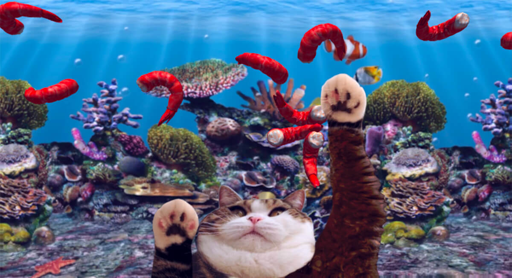

# [shrimpc.at](http://shrimpc.at)

[](http://shrimpc.at)

Wanna understand more how it works? Go to:

#### http://shrimpc.at?debug

## Tools used

- [**three.js**](https://github.com/mrdoob/three.js/)
- [**cannon.js**](https://github.com/schteppe/cannon.js) for physics
- [**tween.js**](https://github.com/tweenjs/tween.js/) to animate the arms
- [**pixi.js**](https://github.com/pixijs/pixi.js) for the postprocessing
- **yourmom.js** for everything else

[**threejs-modern-app**](https://github.com/marcofugaro/threejs-modern-app) was used as a starter-kit, to glue all those libraries together, also as a component organizer, three.js boilerplate concealer and asset loader.

## Highlights

- Simulate quadratic drag force in cannon.js!

```js
class CannonSuperBody extends CANNON.Body {
  // Fd = - Constant * getMagnitude(velocity)**2 * normalize(velocity)
  applyDrag(coefficient) {
    const speed = this.velocity.length()

    const dragMagnitude = coefficient * speed ** 2

    const drag = this.velocity.clone()
    drag.scale(-1, drag)

    drag.normalize()

    drag.scale(dragMagnitude, drag)

    this.applyGenericForce(drag)
  }

  // apply a force in its center of mass
  applyGenericForce(force) {
    const centerInWorldCoords = this.pointToWorldFrame(new CANNON.Vec3())
    this.applyForce(force, centerInWorldCoords)
  }
}
```


- Shrimps jumping up and down in the van (this was fun!)

```js
// make the shrimps jump up and down
this.vanShrimps.forEach((shrimp, i) => {
  shrimp.position.y = this.initialY + Math.sin(time * 20 + i) * 0.09
})
```


- 3D cat face created starting from this image. I used blender!


- Random displacement to fry the shrimp!

TODO
